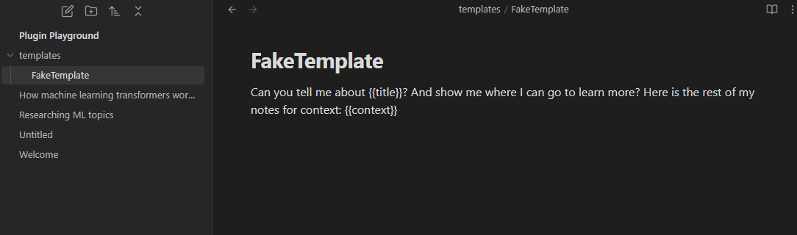
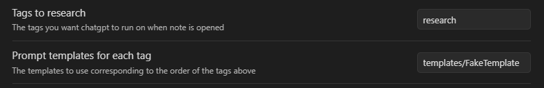
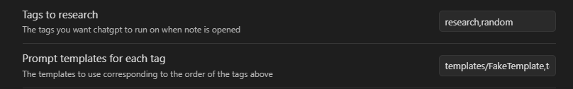
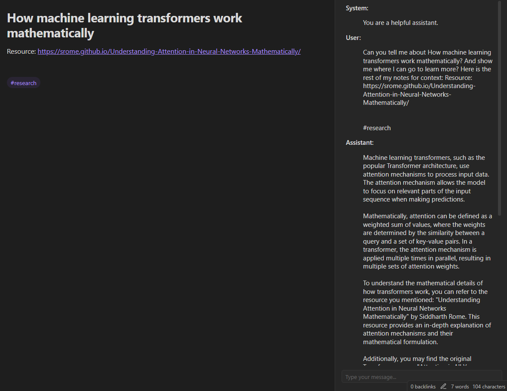
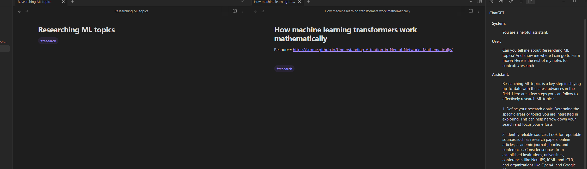
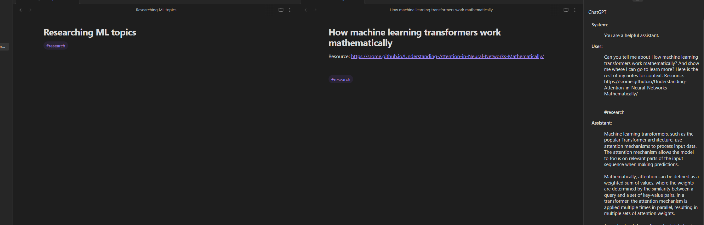

# ChatGPT Templated Prompts

In order to maximize the efficiency of ChatGPT, you need a good prompt.

It's so important that there are guides on how to write good ChatGPT prompts: https://www.coursera.org/articles/how-to-write-chatgpt-prompts

What this plugin does: 
- Removes workflow friction by creating and sending prompts to ChatGPT when you create/open a note

All you have to do is create a template in your notes, assign a tag, and this plugin will send a prompt to ChatGPT using your template.

An example prompt you can use:
~~~
I want to delve deeper into {{title}}? Can you:
1. Provide a quick summary
2. Provide a YouTube video of where I can learn more
3. Show me articles or links I can read for more information

 Here is what I have so far: 
 {{context}}
~~~

or 

~~~
I want to get started on {{title}}. Can you:
1. Provide a roadmap or step by step instructions on how to get started
2. A quick summary on the topic 
3. Provide a YouTube video of where I can learn more
~~~

- {{title}} is replaced with the note's title (required)
- {{context}} is replaced with what you currently have written in your notes (up to 5000 chars), this is optional

Then assign a tag and a template in the settings:

You can assign multiple (tag + template pairs) by seperating each with commas. Just make sure the tag and template you want associated with each other are in the same order (And no spaces between the commas!):

Then when you open a file with that tag, you'll get a response from ChatGPT with your prompt:

## How To Use

- Install this from the obsidian community plugins
- Enable it
- Get your api key from: https://platform.openai.com/api-keys
- Create a template like the example above, make sure to use {{title}} (and optionally {{context}})
- Open the "Prompt ChatGPT" settings
- Add the api key
- Add the path to the template and the tag associated with it
- Open a file and watch it work

## Additional Features

### Chatbox To Ask ChatGPT Further Questions

It'd be a bad ChatGPT plugin if you couldn't communicate directly with it. 

Useful feature so users can ask further questions after the prompt.

### One Conversation Per Note

The view on the side updates for whatever note your cursor is on. So ChatGPT will not have overlapping context if you're switching between notes.

Cursor is on the left note:

Cursor is on the right note:

### Conversation Retention

ChatGPT's api has a limit for how many responses a free user can send: https://medium.com/apis-with-valentine/chatgpt-openai-api-error-you-exceeded-your-current-quota-please-check-your-plan-and-billing-327ecca7144e

Ideally this api would create new conversations with ChatGPT everytime, but that would make this plugin only feasible for users who pay a subscription to ChatGPT.

Storing every conversation is expensive, especially if the user has many notes each with a conversation to ChatGPT.

So this plugin stores your latest conversation from ChatGPT up to the amount of days you specify in the settings. How long you set it will reduce your chances of hitting the quota. But setting it too high will have an effect on your performance (cap is 30 days).

### Custom ChatGPT Behavior

In the settings you can change ChatGPT's behavior. The default is "You are a helpful assistant." But you can make it quirky if you want. 

Kind of just a fun feature, but it's in ChatGPT's api so I figured I'd make it customizable for users too.